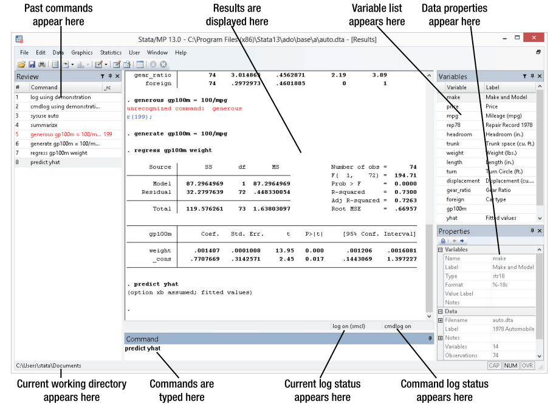
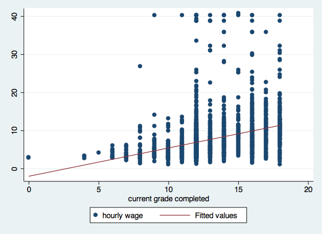
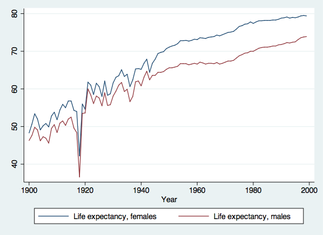

# First Impression

When you open Stata, five windows would pop out. They are the Results window, the Command window, the Variable window, the Data Properties window and the Review window (See Figure 1). For simplicity, we will just use the Results and the Command window, and we can close other windows. The Result window presents statistical outputs as per request. And your request is accepted or denied when you issue a command in the Command window. 

Try to type in your first command in the Command window and hit enter in the keyboard:

    display 1 + 1

Although you can type one command after another one in the Command window, a more efficient and convenient way is to type all your code in a do-file, and let Stata "do" the do-file. You can then read all the output in the Results window.

To start writing your first do-file in Stata's editor, type 
    
    doedit

in the Command window to open an empty do-file. 

Now what? Well, how about typing a template for all your future homeworks? The following commands make up a simple template to be used in Econ 534:

    clear 
    set more off 
    cd D:/econ534 
    use xxx.dta

The __`clear`__ command tells Stata to clear any data that is currently used by the program, so that you can load your own data. The __`set more off`__ command will give you a smooth output in the output window. The __`cd`__ command means "change directory" and Stata would switch its working directory to where you want to put your data files or use any downloaded Stata commands that has been added to the folder. In the above example, we use the folder __`D:\econ534`__ as a demonstration.[^1] A good practice is to put one project into a single folder. Finally, the command __`use`__ ask Stata to load the data set for further exploration.[^2]

Apart from the command __`use`__, Stata's __`sysuse`__ allows us to pull up existing data sets in the system once the Stata program is installed. For further illustration, change your simple template into the following way:

    clear
    set more off
    cd D:/econ534
    sysuse nlsw88

and press keyboard shortcut __`Ctrl + D`__ to "do" the program you just wrote.[^3] Check your output window, you have asked Stata to load the National Longitudinal Survey of Young Women and Mature Women in year 1988. Note that Stata's data file format __`.dta`__ is permissibly omitted.

[^1]: For Mac user, the directory might looks like __`/Users/Johnson/Documents/econ300/`__.

[^2]: All the data provided by Econ 534 will be Stata's default data format, ending with __`.dta`__. The __`use`__ command would be enough for your problem set. If you find your own data in other format, say in a Microsoft Excel spreadsheet, Stata also offer an __`import`__ command to load data in other format.

[^3]: For Mac user, the "do" keyboard shortcut is __`Command + Shift + D`__.

# Exploring Data and Summary Statistics

A data set contains __variables__ and __observations__ on those variables. To see what variables are included in a given data set, add the command

    describe

to your simple template and do the "do-file". The Results window shows information like variable names, number of observations, and variable labels, etc. The variable label is particular useful as it contains simple description of the variables. 

If you are curious how the data actually looks like, try to type __`edit`__ or __`browse`__ in the Command window. A data window would pop out and presents data in a spreadsheet style.

Looking at all observations is not an economical way to understand the distribution of a particular variable. In an introductory statistics course, you have learn that __mean__ and __standard deviation__ can characterize a given variable. Thus, add the command

    summarize

to your simple template and do the "do-file" to gain a simple summary table of all variables in the data set __`nlsw88`__.

# Two Most Frequently Used Plots

In econometrics, __scatter plot__ and __time series plot__ are two most frequently used plots. __Scatter plot__ captures relationship between two variables and has been used a lot in cross-sectional data. __Time series plot__ demonstrates how one variable changes over time and is particular useful for time series data. Our data set __`nlsw88`__ is a cross section that contains classical labor economics variables like __`wage`__ and __`grade`__. Add the command

    twoway (scatter wage grade) (lfit wage grade)

to your do-file and press keyboard shortcut "Ctrl + D" (or "Command + Shift + D" for Mac user). Stata would generate Figure 2, a classical scatter plot with an OLS regression line, saying (perhaps naively) that the return to schooling is positive.

Notice that the scatter plot command consists of two parenthesis, try deleting one of them and see what you get. 

To draw a time series plot, let's use the command window to issue command. First, type in 

    sysuse uslifeexp, clear

and hit enter in the keyboard to load a time series data that documents the U.S. life expectancy. Then, type in

    tsset year

to indicate the time variable. Finally, type in 

    tw (tsline le_female) (tsline le_male)

to get Figure 3.

The Command window is useful when you have short commands or want to get the result immediately. But putting your code in an editor enable you to preserve and edit your work. For writing your own project, no matter how small it is, we recommend using Stata's editor. This is not to say that the command window is useless. There are certain scenario that the Command window provides an appropriate way to interact with Stata. For instance, when we ask Stata for help.

# Two Most Frequently Used Commands

The __`help`__ command is arguably the most frequently used command for all Stata users. The universe of Stata commands keep expanding since every version of Stata incorporates more commands (StataCorp is shipping the 13^nd^ version). And unsatisfied Stata users also contribute a great amount of user written commands.[^4] Thus, it is impossible for any users to know every command so the __`help`__ command acts as a way of getting to know a new command.

It would be a good exercise to see the help documents of the command __`regress`__, which is also the second most frequently used command. Type in 

    help regress

in the Command window. Hitting enter will give you a detailed explanation of how to use the __`regress`__ to run an OLS regression. For starter, most "help" documents is too long and can look daunting. Thus we suggest scrolling down to the example section and learn the command by doing. The example section of the __`regress`__ help document provides the following commands:

    sysuse auto, clear
    regress mpg weight c.weight#c.weight foreign

Try to type them in the Command window and see the printout. 

Or to run your own simple regression, go back to your template. Add the command __`regress wage grade`__ to see the return to education. Note that the independent variable ("y") always comes first after the command __`regress`__.

To sum, if you follow the instructions up to this point, you will have the following do-file that represents a mini project using Stata. 

    clear
    set more off
    cd D:/econ300
    sysuse nlsw88

    describe
    summarize

    twoway (scatter wage grade) (lfit wage grade)
    regress wage grade

For interpreting scatter plot and regression printout, seek help from your econometrics textbook, or your TAs during the lab section. Have fun.

[^4]: For a list of user written commands, see online series [Statistical Software Components].

[Statistical Software Components]:http://ideas.repec.org/s/boc/bocode.html

